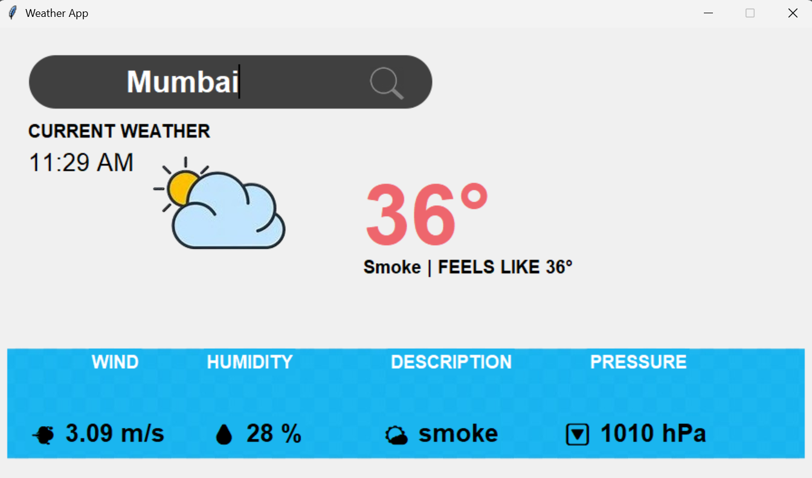

# 🌦️ Weather Application (Python + Tkinter)

## 📌 Description

This is a desktop-based Weather Application developed using Python and Tkinter. The application fetches real-time weather data using an API and displays it in a simple and user-friendly graphical interface.

---

## 🚀 Features

* 🌍 Search weather by city name
* 🌡️ Displays temperature, humidity, and weather conditions
* 🔄 Fetches real-time weather data using API
* 🖥️ User-friendly GUI built with Tkinter

---

## 🛠️ Technologies Used

* Python
* Tkinter (GUI)
* Requests (API handling)

---

## 📷 Screenshots



---

## ⚙️ Installation & Setup

1. Clone the repository:

```
git clone https://github.com/your-SahilKamble-dev/weather-api-python.git
```

2. Go to project folder:

```
cd weather-app-python
```

3. Install dependencies:

```
pip install -r requirements.txt
```

4. Run the app:

```
python main.py
```

---

## 🔑 API Key Setup

1. Go to OpenWeather website and create a free account
2. Generate your API key
3. Open the project file (main.py)
4. Replace the API key with your own:

api_key = "YOUR_API_KEY_HERE"

5. Save the file and run the application


## 🎯 Future Improvements

* Add weather icons
* Improve UI design
* Add 5-day forecast

---

## 🙌 Author

**Sahil Kamble**

---

## 📄 License

This project is licensed under the MIT License.
